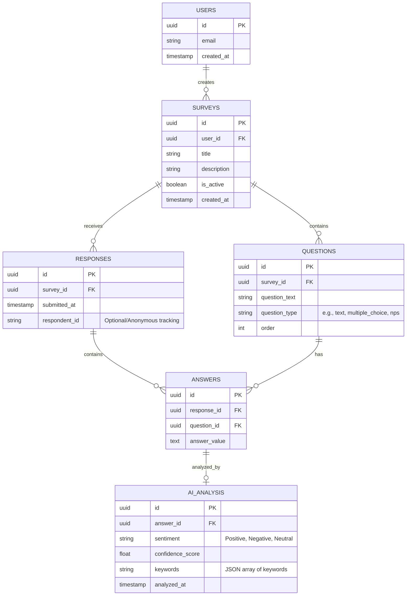

# Documento de Arquitectura: SentinelFeedback

## 1. Stack Tecnológico Recomendado
Basado en los requerimientos del producto (PRD), el stack definido es:

*   **Frontend Aplicación Web:** React con Vite. Proporciona una experiencia de usuario rápida y un ecosistema de desarrollo moderno y ágil. Se utilizará Tailwind CSS para los estilos.
*   **Backend / Base de Datos / Autenticación:** Supabase. Al ser un BaaS (Backend as a Service) basado en PostgreSQL, nos ofrece autenticación, base de datos relacional y Row Level Security (RLS) listos para usar, acelerando el desarrollo del MVP.
*   **Procesamiento de IA:** Gemini API. Se integrará para el procesamiento asíncrono o sincrónico (dependiendo de la carga) para evaluar los sentimientos de las respuestas de texto libre enviadas por los encuestados.
*   **Funciones Cloud / Backend Lógico:** Supabase Edge Functions (usando Deno) o un backend Node.js ligero (si se prefiere separar la lógica). Para simplificar la arquitectura inicial y mantener todo bajo el ecosistema de Supabase, usaremos **Supabase Edge Functions** o un entorno **Node.js** interactuando con la BD de Supabase. Para este MVP en el contexto del Workflow, podemos simular un backend Express/Node.js interactuando con Supabase, según como se estructure en la sig. fase, o usar las Edge Functions directamente. Asumiremos, para mayor flexibilidad, un backend **Node.js (Express)** para orquestar las llamadas a la API de Gemini fácilmente usando el SDK oficial de Google.

## 2. Diagrama Entidad-Relación (ERD)



## 3. Decisiones de Arquitectura

1.  **Row Level Security (RLS) en Supabase:** Los creadores de encuestas (`USERS`) solo podrán leer/modificar las encuestas (`SURVEYS`) y ver las respuestas (`RESPONSES`) que correspondan a su `user_id`. Los usuarios finales que completan la encuesta tendrán permisos de solo-inserción (INSERT) para las respuestas.
2.  **Flujo Crítico de IA:**
    *   El usuario final envía la encuesta (`RESPONSES` y `ANSWERS`).
    *   Para no penalizar el tiempo de respuesta del usuario que envía el formulario, el análisis de IA de las preguntas de tipo texto debería ejecutarse de forma asíncrona.
    *   *Propuesta MVP*: Al insertar una respuesta de tipo texto en `ANSWERS`, mediante un Webhook en la base de datos de Supabase, se puede invocar al backend de Node.js (o Edge Function), el cual conecta con la **API de Gemini**. Una vez que Gemini retorna el resultado del análisis de sentimiento, el backend actualiza/inserta el registro correspondiente en la tabla `AI_ANALYSIS`.
3.  **Seguridad y Privacidad:** Las llamadas a la API de Gemini se realizarán exclusivamente desde el servidor (Node.js/Edge Functions) para proteger la llave de API (API Key). No se deben enviar PII (Personal Identifiable Information) al modelo si no es estrictamente necesario para el análisis del sentimiento.

## 4. Estructura de Proyecto Recomendada
Un enfoque de monorepo simplificado para MVP:
```text
/sentinel-feedback
  /frontend         # React + Vite app
  /backend          # Node.js API (o configuraciones de Supabase Edge Functions)
  /supabase         # Migraciones y esquema local de DB (Supabase CLI)
```
